# Quantum Vizz

Arquivo de trabalho para revisão textual do case.

Este documento é uma versão limpa do conteúdo do projeto. Ele não substitui o arquivo fonte do site em `src/projetos/quantum-vizz.md`.

## Dados principais

- Projeto: Quantum Vizz
- Serviço: Growth, UX e CRO
- Stack: Figma, Hotjar, Analytics, WordPress
- Ano: 2025
- Case no site local: `/projetos/quantum-vizz/`
- Imagem principal: `src/assets/projetos/quantum-vizz/cover-hover.webp`

## Hero

Tag:

Crescimento, CRO, conversão orientada por comportamento.

Título:

Quantum Vizz

Subtítulo:

Como aumentei em +194% a taxa de conversão de uma página de campanha de Google Ads através de análise de dados, hipóteses e testes A/B.

## Resumo do projeto

### Situação

A Quantum Vizz rodava campanhas de Google Ads com CTR acima de 8%, mas a conversão da página de campanha não passava de 0,71%. Alto investimento em mídia, retorno quase zero.

### Tarefa

Identificar os gargalos de conversão e redesenhar a experiência da página de campanha sem aumentar o investimento em mídia.

### Ação

Analisei comportamento no Hotjar, mapas de calor e rolagem, relatórios de Google Ads, intenção de busca e sinais nas redes sociais. Reformulei texto, hierarquia e chamadas para ação. Implementei o redesenho em WordPress + Elementor e acompanhei o teste A/B até validar o resultado.

### Resultado

Taxa de conversão subiu de 0,71% para 2,09%, totalizando +194%. Tempo médio de sessão cresceu +42,8%. Tudo sem aumentar o orçamento de mídia.

## Métricas principais

- +194% de aumento na taxa de conversão
- +42,8% no tempo médio de sessão
- 8 semanas do diagnóstico ao resultado validado

## Contexto

### Alto tráfego, conversão quase zero.

A Quantum Vizz é um estúdio de visualização 3D para o mercado imobiliário e arquitetônico. O site já estava desenvolvido e rodava campanhas de Google Ads com CTR acima de 8%, mas a conversão não acompanhava. Menos de 1% dos visitantes concluíam uma ação.

O problema não era falta de tráfego nem de investimento em mídia. Era comunicação, hierarquia de informações e experiência de navegação. Fui chamado para investigar e corrigir exatamente isso.

## Diagnóstico

### O que os dados revelaram

- 8%+ de CTR nas campanhas de Google Ads. Bom tráfego entrando, mas a página não convertia.
- Queda de rolagem. O mapa de calor mostrava saída antes da galeria de projetos, que estava quase no final da página.

Imagem:

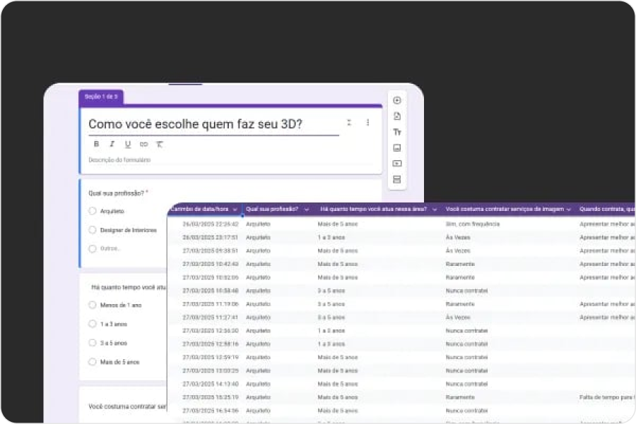

Legenda:

Pesquisa quantitativa, base para as hipóteses de otimização.

## Problema central

Como aumentar a taxa de conversão sem aumentar o investimento em mídia?

## Gargalos encontrados

- O site não comunicava o que era oferecido, para quem e qual o diferencial.
- A hierarquia priorizava estética em detrimento de clareza e persuasão.
- Sem prova social relevante, texto sem direcionamento e chamadas para ação pouco estratégicas.
- Conteúdo desalinhado das intenções de busca identificadas nas campanhas.

## Hipóteses

### Reorganização da página a partir das hipóteses.

Elaborei uma nova hierarquia de conteúdo priorizando proposta de valor clara no topo, galeria de projetos na segunda dobra e texto alinhado com a intenção de busca real do público.

Imagem:

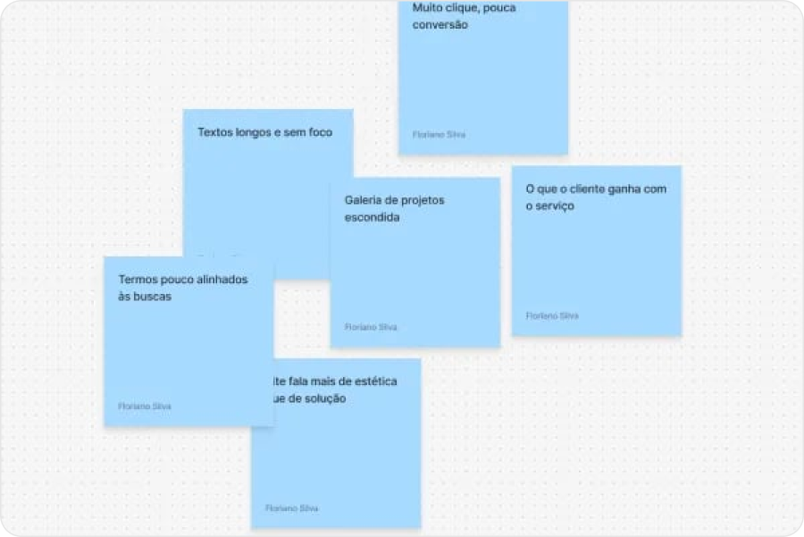

## Teste A/B

### Antes e depois

4 seções reestruturadas. Cada mudança baseada em dado de comportamento, nenhuma decisão por gosto visual.

### Seção 01, Topo da página

Título:

Proposta de valor no lugar do logo

Nota:

O logo tinha mais destaque que a mensagem principal. Foi substituído por uma frase que responde imediatamente o que o serviço entrega e para quem.

Antes:

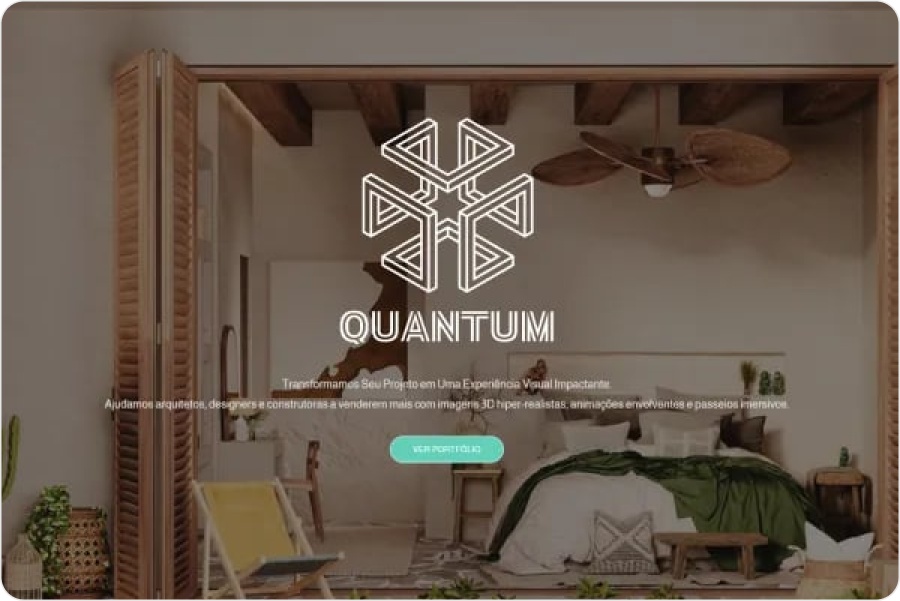

Depois:

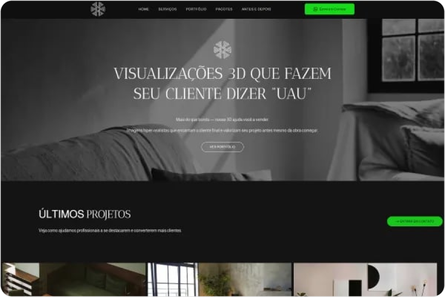

### Seção 02, Galeria

Título:

Portfólio na segunda dobra

Nota:

A galeria de projetos estava quase no final. Movida para a segunda dobra: o usuário vê o trabalho antes de decidir continuar lendo.

Antes:

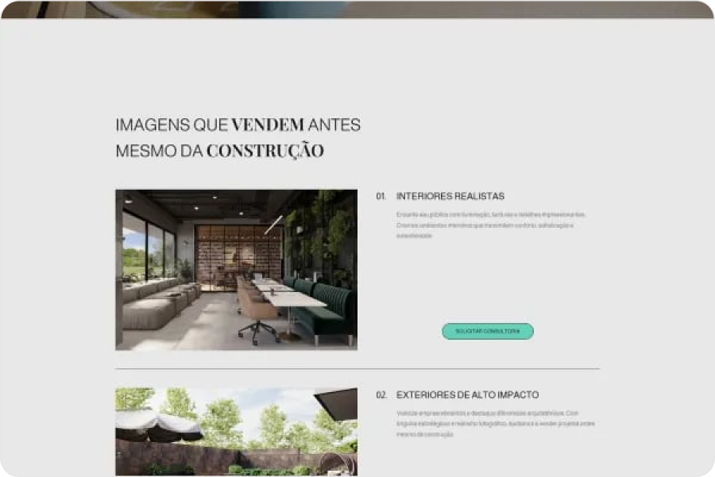

Depois:

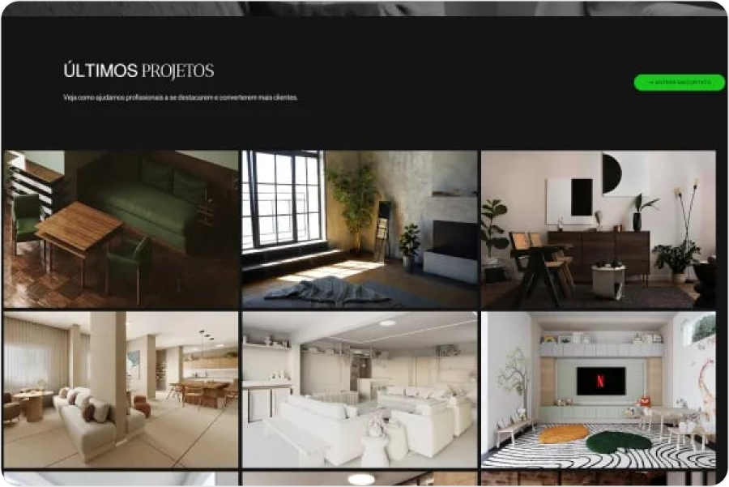

### Seção 03, Prova social

Título:

Mais evidência antes da decisão

Nota:

A seção foi reestruturada para mostrar exemplos e sinais de confiança com mais clareza, aproximando a decisão do usuário da prova visual do serviço.

Antes:

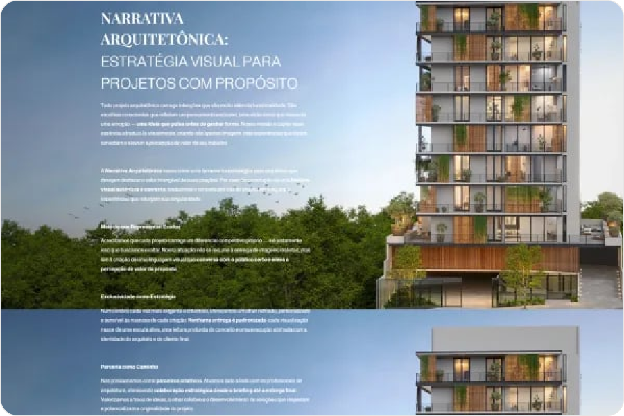

Depois:

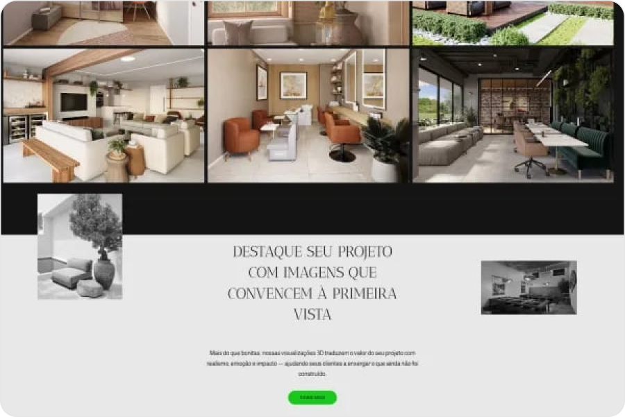

### Seção 04, Texto e chamada para ação

Título:

Mensagem alinhada com intenção de busca

Nota:

100% dos textos reescritos com foco em conexão emocional e alinhamento com os termos reais das campanhas de Google Ads.

Antes:

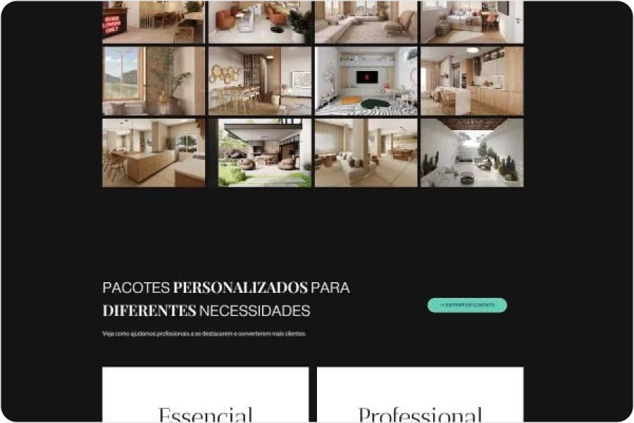

Depois:

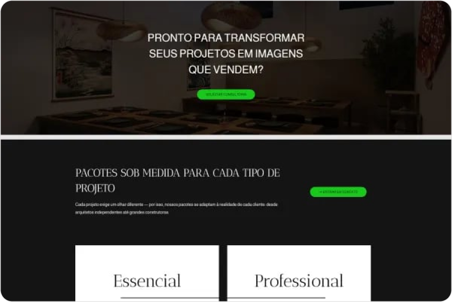

## Resultado

### +194% de conversão validado por teste A/B

- +194% na taxa de conversão das campanhas de Google Ads
- +42,8% no tempo médio de navegação por sessão
- 0,71% para 2,09% na conversão V1 vs. V2 no teste A/B

### Fórmula da variação percentual

Também chamada de aumento percentual relativo, ela mede quanto a nova taxa cresceu em relação ao ponto de partida.

`((2,09% - 0,71%) / 0,71%) x 100 = 194,36%`

Foi usada porque o objetivo era comparar o desempenho da V2 contra a V1, não apenas mostrar a diferença absoluta de 1,38 ponto percentual. Arredondado, o crescimento relativo fica em +194%.

Imagem:

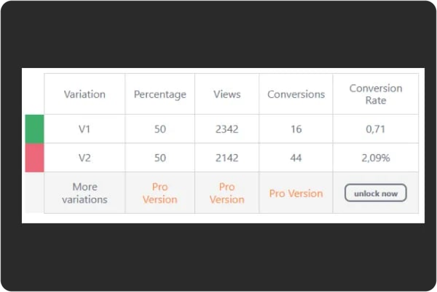

Legenda:

Teste A/B: V1 0,71% para V2 2,09%.

Imagem:

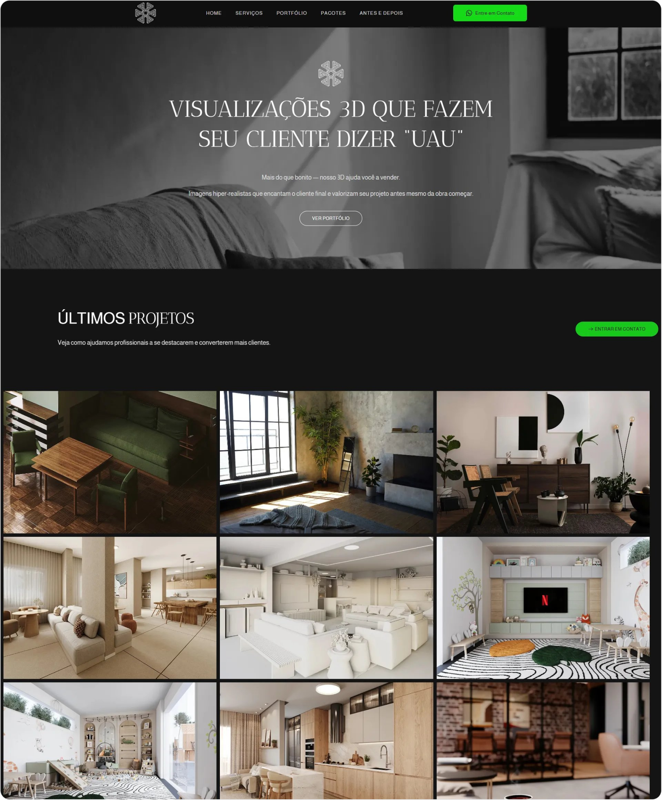

Legenda:

Site completo, estrutura otimizada para conversão.

## Aprendizados

### O que este projeto prova

- Consigo traduzir comportamento em hipótese de crescimento. Nenhuma mudança partiu de gosto pessoal: tudo começou em sinais reais de uso, leitura de campanha e intenção de busca.
- Hierarquia de informação é decisão de produto. A reorganização não foi cosmética: serviu para reduzir dúvida, aumentar clareza e encurtar o caminho até a ação principal.
- Sei medir impacto com honestidade. O ganho veio com teste A/B comparativo: o valor do trabalho não estava no redesign em si, mas na capacidade de mover uma métrica de negócio.

## Papel no projeto

### Papel

- Designer de experiências digitais

### Skills

- Growth
- CRO
- Pesquisa em redes sociais

### Ferramentas

- Figma
- WordPress
- Elementor
- Hotjar
- Google Analytics
- Google Ads

### Métodos

- Teste A/B
- Análise comportamental
- Copywriting para conversão

### Duração

- 8 semanas
- 2025

## Próximo projeto

- Título: 2P Web Dev
- Link: `/projetos/2p-web-dev/`

## Lista de imagens do case

- `src/assets/projetos/quantum-vizz/cover-hover.webp`
- `src/assets/projetos/quantum-vizz/pesquisa-quantitativa.webp`
- `src/assets/projetos/quantum-vizz/board-hipoteses.webp`
- `src/assets/projetos/quantum-vizz/sec01-hero-antes.webp`
- `src/assets/projetos/quantum-vizz/sec01-hero-depois.webp`
- `src/assets/projetos/quantum-vizz/sec02-proposta-antes.webp`
- `src/assets/projetos/quantum-vizz/sec02-galeria-depois.webp`
- `src/assets/projetos/quantum-vizz/sec03-narrativa-antes.webp`
- `src/assets/projetos/quantum-vizz/sec03-prova-depois.webp`
- `src/assets/projetos/quantum-vizz/sec04-pacotes-antes.webp`
- `src/assets/projetos/quantum-vizz/sec04-cta-depois.webp`
- `src/assets/projetos/quantum-vizz/resultado-teste-ab.webp`
- `src/assets/projetos/quantum-vizz/novo-site-completo.webp`
